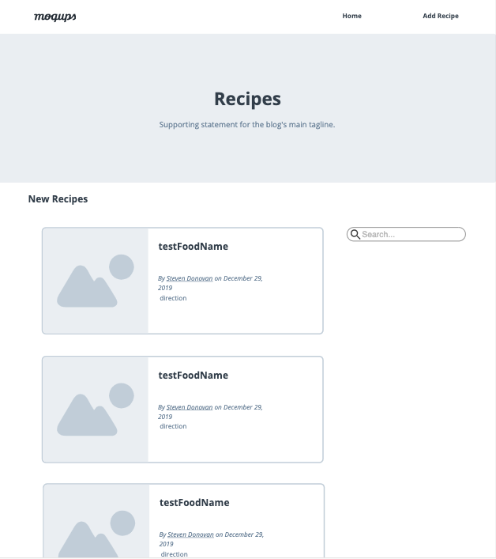

# FoodBlog
This website is an online food blog that allows you to add, edit, and delete recipes. It is equipped with a search option for easy access to your recipes.

Project status: Prototype

## Technologies used:
Node.js  
Express.js  
MongoDB  
Mongoose  
Boostrap 4  
Moment.js  

## Wireframe

## App Demo 
Please take a look at my project hosted on Heroku
https://food3.herokuapp.com/Fblog
# Alexber17.github.io
